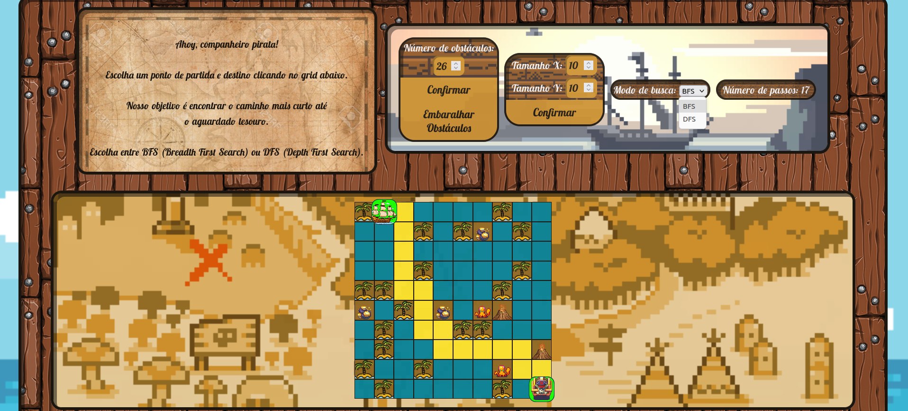

# Caça ao Tesouro

**Número da Lista**: 1 
**Conteúdo da Disciplina**: Grafos 1  

## Alunos
|Matrícula | Aluno |
| -- | -- |
| 19/0057858  |  José Luís Ramos Teixeira |
| 19/0038900  |  Victor de Souza Cabral |

## Sobre 
O objetivo deste projeto é criar um jogo em que o usuário posiciona em um mapa (grid) de quadrados um navio no ponto de início e um tesouro no ponto de destino. A partir disso, o programa utiliza o algoritmo Breadth First Search (BFS) ou Depth First Search (DFS) para encontrar o caminho do navio até o tesouro.

O programa possui as funções de escolher o número de obstáculos, embaralhar eles, alterar o tamanho do grid para um máximo de 20x20, selecionar o tipo de busca e informar o número de passos que foram precisos para se chegar no baú.

## Screenshots

## Vídeo de Apresentação

## Instalação 
**Linguagem**: HTML, CSS e JavaScript 
**Framework**: Não há necessidade de instalar nenhum framework. Para rodar o projeto, basta clonar o repositório e abrir o arquivo index.html no navegador ou acessar o link. 

## Uso 
Acessar o link <https://projeto-de-algoritmos.github.io/Grafos1_Caca-Tesouro/>

Após abrir no navegador, o usuário pode selecionar o navio e o tesouro clicando em dois quadrados no mapa. O programa irá então calcular o caminho mais curto utilizando o algoritmo BFS ou DFS e exibir o caminho no mapa. 

Observação: estamos trabalhando na responsividade dos elementos, então recomendo manter o zoom da página em 100% para evitar a quebra do grid.

## Outros 
Este projeto foi criado como parte do curso de Projeto de Algoritmos da Fcauldade do Gama - Universidade de Brasília (FGA-UnB). Qualquer sugestão ou contribuição é bem-vinda.
